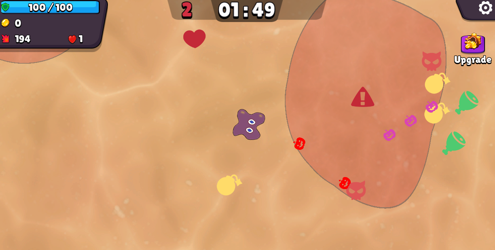

# Concept
Top down co-op 2D bullet shooter where the player controls a cell and fights off bacteria from growing tumors.

## Purpose
Practice on quickly prototyping a peer to peer shooter, while managing tasks with JIRA and documentation with Confluence.

## Info
* Duration: ~3-4 weeks
* Team size: 1

## Technologies
* Unity3D
* C#
* Mirror - For the co-op network handling
* Vertex shaders
* JIRA / Confluence

## Screenshots
General gameplay:

 

Menu:

 

Some simple effects:

 