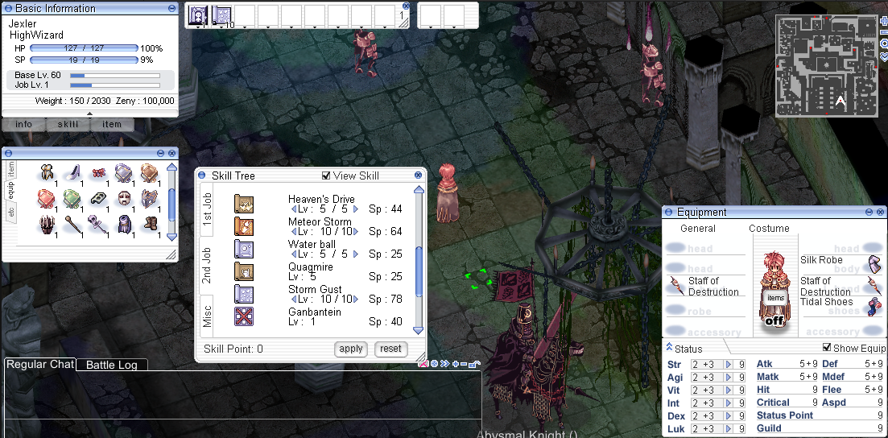
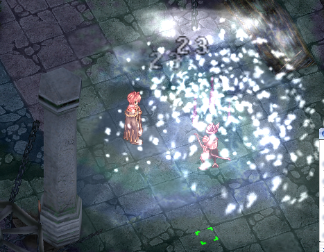
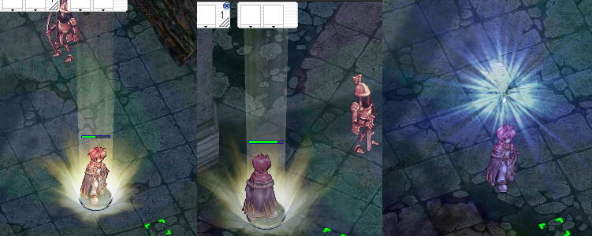
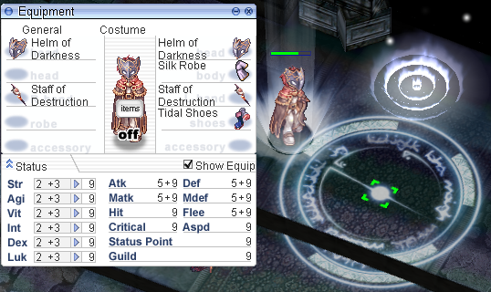
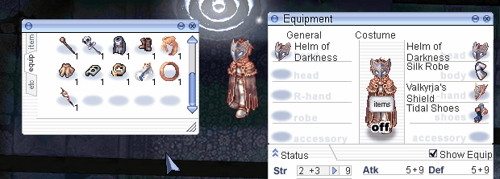

# Concept
Remake of an MMORPG called RagnarokOnline, both the client (Unity C#) and the server (C++)

## Purposes
Learn large scale game development in a client - server architecture.
Practice unity skills and learn shaders / meshes.
Practice train of thought in server side validation to prevent exploits.

## Info
* Duration: ~1.5 years
* Team size: 2
* Note: Due to not having worked alone in this project, I have removed the source files that I did not work on.

## Technologies
* Unity3D
* C# - Client
* C++ - Server
* Vertex shaders
* TCP - Network layer for both client and server, written from scratch

## Screenshots
Game view:

 

Effects:

 

## Gifs
Movement and effects

 

Equipment

 

Water

 

Bushes

 